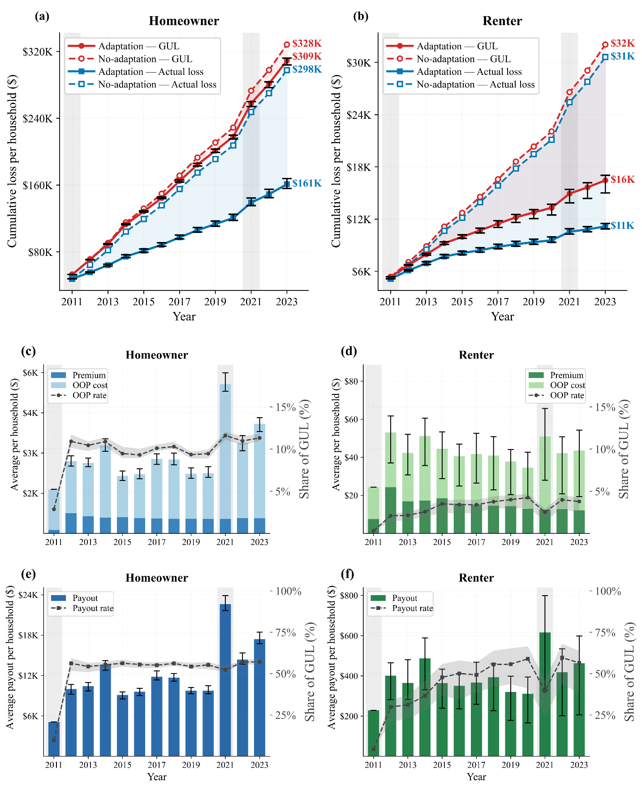
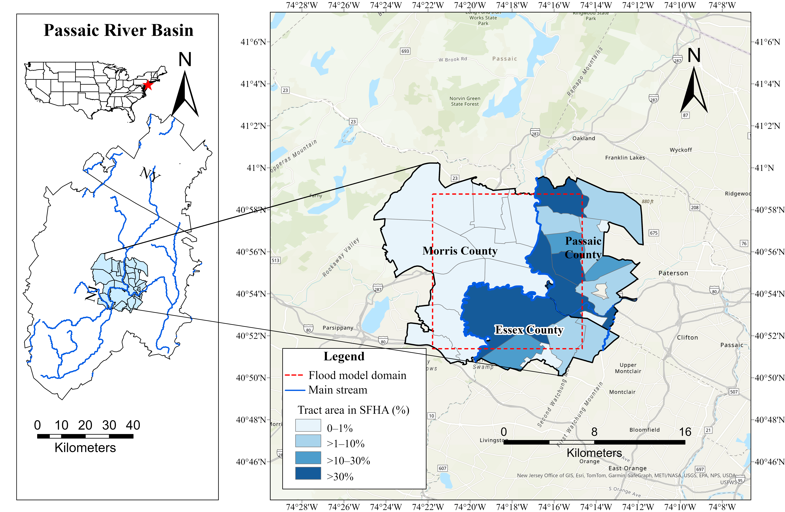

# Figures, Tables, Captions, and Supporting Material

## Contents

1. Reader function and final-size legibility
2. Captions and table notes
3. Synchronization and SM
4. Project formatting and notation
5. Worked ABM examples
6. Maps, borders, and grids

## Reader Function and Final-Size Legibility

Give each display a clear primary analytical purpose. Select a visual only when it makes the relationship easier to understand than prose. Check whether its title, evidence, panels, and surrounding text serve that purpose; use [results-and-explanation.md](results-and-explanation.md) for question alignment without a rigid one-to-one rule.

Inspect the rendered display at its actual final display size, including its placement in the document. Verify readable labels, legend, axes, units, lines, markers, categories, annotations, and table entries. Check clipping, overlap, obstructed values, misleading color interpretation, and distinguishability under likely viewing conditions. A high-resolution source is not evidence that an undersized embedded figure is readable.

Reduce nonfunctional whitespace around the plot or between panels while retaining useful separation, scale, and breathing room. Do not fill every empty area, crowd the legend over evidence, stretch aspect ratios, alter comparison scales without justification, or crop needed annotations to make a figure look larger. Use verified venue specifications when they exist; do not invent a universal font-size or page-fill target.

Inspect legends and annotations together after resizing text. A larger legend must not cover a value or truncate a label. For maps, preserve meaningful geographic context, clear scale bars, category definitions, and readable place labels. An area percentage is not a population percentage. If actual layout cannot be inspected, report that limit instead of certifying the visual as readable.

## Captions and Table Notes

Use a concise descriptive caption title followed by information necessary to read the figure independently: groups, scenario or baseline, relevant period, panel assignments, colors or line types, units and normalization, summary statistic, sample/run count where needed, and uncertainty definition. Avoid narrating every result or duplicating the main text. A defined uncertainty convention in Methods can reduce repetition, but retain enough in the caption to prevent ambiguous bands or error bars.

Use a concise table title. Put compact reading information in a table note: baseline, units, denominator, statistic, uncertainty, signs, and design conditions needed to interpret entries. Keep the scientific reason for an experiment and its substantive interpretation in prose, not solely in a note. For sensitivity figures in SM, explain the changed factor and comparison design in the caption; for sensitivity tables, use notes for the corresponding entry-reading details without adding a redundant results essay.

Make a symbol's meaning clear before a reader must interpret it. A normal equation followed by a `where` clause can define its symbols; avoid earlier prose that depends on an undefined symbol. Explain the role of a specialized tool or institution, not only the acronym's expansion. Define abbreviations at independent reading boundaries as needed, not mechanically in every caption.

## Synchronization and SM

Develop SM alongside Methods and Results. Keep essential method logic and main-question evidence in the manuscript; place instruments, derivations, settings, and extended evidence in SM with a clear main-text pointer. Related main and supplementary tables need different reader functions, not duplicate complete entries.

For accepted/submitted revisions, retain functioning original SM wording and organization unless a changed result, promised addition, verified error, or necessary dependency requires repair. Move rather than silently discard displaced material when it is still needed. Do not add commentary merely to make an unchanged supplement appear revised.

After reordering, removing, combining, or splitting items, reconcile main-text callouts, panel letters, in-document captions, final figure/table lists, SM contents, notes, and response references. Inspect each old reference by its function; do not blindly replace an old item number that could now refer to something else. Align reported numbers with underlying outputs and saved final figure files. Preserve editable sources and direct reproducibility dependencies under the project's agreed storage convention.

Check clean and tracked versions using the effective revised text, excluding deleted or moved-from text. Check preserved comments, authors, fields, image placement, table breaks, and residual blank objects with the appropriate document skill. XML checks do not replace inspection of rendered layout.

## Project Formatting and Notation

Treat bold callouts, range connectors, title casing, caption ordering, and acronym preferences as project or venue conventions, not universal journal rules. Record and apply the active convention consistently across selected artifacts.

For example, a project can prefer **Figures S4** to **S6**, with the references bold and `to` plain, or **Figure 7** for a single figure. This is a reusable formatting example, not a mandate for every paper. Match singular/plural forms to the actual number of referenced items. Update title labels and final lists consistently rather than adding bold to the whole document.

Keep units, denominators, and quantity names consistent in captions, tables, equations, and prose. A normalized difference/GUL percentage and a normalized difference/income percentage are distinct metrics despite common percent units. Label an axis for the plotted quantity, not an annotation such as a margin between two curves. Use stable technical terms and clarify absolute differences, relative changes, and percentage-point differences where they matter.

## Worked ABM Examples

Use these author-requested examples to understand display functions, not to import this model's facts into another paper. The source is `ABM_manuscript_20260812_WC_clean_label.docx` (SHA-256 `5464b65aa813777fe00fe90bd41255b7be07b842487ee13db42bd4b9815c5176`). Its effective text has no tracked-change nodes. The original table and figure-caption text below are preserved; merged FI labels are repeated for Markdown. The figure is extracted without alteration. Teaching annotations are separate and do not modify the manuscript.

### Original Table 1

**Table 1.** Stochastic adoption threshold bounds by action, household group, and SFHA status.

| Action | Household group | Bounds [lₐ, hₐ] | Rationale | Sources |
|---|---|---|---|---|
| FI | Homeowner inside SFHA | [0.00, 0.10] | Homeowners inside the SFHA may face insurance purchase requirements linked to federally backed mortgages. | FEMA (2025b); Kousky (2018) |
| FI | Homeowner outside SFHA | [0.35, 0.55] | Homeowners outside the SFHA generally purchase FI voluntarily. | Browne & Hoyt (2000); Kousky (2018) |
| FI | Renter | [0.70, 0.90] | Renters generally have lower FI adoption and are not subject to mortgage-linked purchase requirements. | Koller (2025); Kousky (2018) |
| EH | Homeowner | [0.30, 0.60] | Elevating a house requires upfront cost and structural work. | Aerts et al. (2018); FEMA (2014) |
| BP | Homeowner | [0.25, 0.65] | Participation depends on available funding, eligibility, and government approval. | Curran-Groome et al. (2022); Greer & Brokopp Binder (2017) |
| RL | Renter | [0.30, 0.95] | Moving depends on costs, housing availability, employment, and social ties. | Bukvic & Owen (2017); Lee & Van Zandt (2019) |

### Teaching note (added here, not in the manuscript)

The source Table 1 has no separate note; its operational explanation is in Section 3.2.2. A note illustrating how to make this table independently readable is:

> **Note.** FI, flood insurance; EH, house elevation; BP, buyout program; RL, relocation; SFHA, Special Flood Hazard Area. The bounds specify dimensionless intervals for uniformly drawn adoption thresholds, not empirically estimated confidence intervals or observed adoption rates. An action is adopted when its predicted probability exceeds the threshold. Lower thresholds therefore make adoption easier at the same predicted probability. The intervals are model assumptions informed by the listed rationales, not estimates from the survey regression. They do not measure household income or establish affordability.

Learn the separation of functions:

- **Title:** identifies what is tabulated and which group/status distinctions matter.
- **Columns:** keep the action, population, numerical setting, rationale, and cited background distinguishable rather than hiding them in one long caption.
- **Note:** explains how to read a value and prevents a threshold from being mistaken for a percentage, uncertainty interval, or measured rate.
- **Methods:** retains the consequential why, operational decision rule, and assumptions; a compact note does not replace that explanation.

The source citations reproduce contextual rationales; they do not substantiate these exact bounds. This worked example does not independently verify the cited papers. For a different study, distinguish evidence for a qualitative rationale from evidence estimating a numerical parameter, and include only the relevant columns and note details.

### Original Figure 6

> **Figure 6.** Flood losses and financial outcomes per household for homeowners (left) and renters (right) from 2011 to 2023. Panels (a) and (b) compare cumulative GUL (red) and actual loss (blue) under the adaptation scenario (solid) and the no-adaptation baseline (dashed). Under the adaptation scenario, panels (c) and (d) show annual premiums, OOP costs, and OOP rates, while panels (e) and (f) show annual insurance payouts and payout rates. Lines and bars show medians across 50 simulation runs, and black error bars indicate the IQR. Gray shading marks major flood years (2011 and 2021).

### Reading the figure-caption design

Here GUL means ground-up loss, OOP means out-of-pocket, and IQR means interquartile range. These explanations are teaching annotations; the manuscript defines its terms elsewhere.

- **Opening:** names the outcomes, unit of comparison, two groups, spatial arrangement, and period before describing individual panels.
- **Panel map:** separates the cumulative scenario comparison in (a)/(b) from annual financial components in (c)/(d) and (e)/(f), making the six-panel organization readable.
- **Encoding:** assigns color to the loss quantity and line type to the scenario. The adaptation-only scope of later panels is explicit.
- **Statistical reading:** identifies medians, the simulation-run count, and the IQR error bars instead of calling every display an average or every interval a confidence interval.
- **Main text:** explains the pathway contrast and its answer to the scientific question. The caption provides reading instructions, not a second Results paragraph.

Preserving this source is not a blanket layout or completeness certification. Inspect remaining filled regions and shaded bands against the actual plotting source, verify rate denominators, and check readability at the final embedded size before adapting a caption. Reading this PNG does not certify its placement in a Word document.

Do not copy the ABM's thresholds, six-panel layout, 50 runs, years, acronyms, or homeowner/renter comparisons into unrelated research. Reuse the decisions behind the examples: identify the display's purpose, keep data and rationale separate, explain encodings and numerical meaning, and retain evidence-supported interpretation in the relevant prose.

## Maps, Borders, and Grids

Apply the active [venue profile](overlay-contract.md) first. Do not infer a journal requirement from a familiar map style, a Markdown table, or a single published article.

### Map reading and spatial meaning

Identify whether a map supplies study context or answers an analytical question. Show the relevant location, basin/administrative boundaries, analysis domain, and sampling/model units distinctly. An inset is useful when readers need geographic orientation, not obligatory decoration. Keep the study region large enough to read without removing necessary context; inspect inset, labels, scale, legend, and main map together at final size.

Explain the mapped quantity, unit, denominator, reference period, and classification. Show class boundaries without overlaps or unexplained gaps; distinguish a valid zero from missing/no-data areas. Use a sequential scale for an ordered magnitude, and a justified diverging scale for changes around a meaningful reference. For bivariate maps, explain both dimensions and each color's interpretation. Neither darker color nor polygon size establishes a larger household count or causal effect.

Retain data source/version/date, coordinate reference system or projection where relevant to distances/areas, and basemap attribution/licensing in the appropriate caption, Methods, or SM. Verify these from editable GIS/source records; do not infer them from a screenshot. Scale bars and orientation aids must remain valid after resizing or reprojection; use a north arrow or coordinate labels when they help orientation, not as an automatic requirement. When comparing maps, reconcile extents, class breaks, normalization, and legend semantics or explain changes. A local color change need not overturn a whole-study conclusion, but its stated spatial interpretation must be updated.

### Original ABM Figure 1

> **Figure 1.** The study area of this paper: the Passaic River Basin and the flood modeling domain with percentages of each census tract’s area within the Special Flood Hazard Area (SFHA).

**Teaching annotation, not source-caption content:** the left panel locates the basin; the enlarged right panel distinguishes the dashed flood-model domain from tract polygons and the river. Four light-to-dark blue classes show tract area in SFHA: 0–1%, >1–10%, >10–30%, and >30%. This is not a household percentage or a direct observation of individual SFHA status. Table/model assignment rules require separate explanation. Scale bars and county labels are examples of geographic reading aids, not inherited requirements for every map.

The original extracted image and caption are preserved. This PNG cannot establish the coordinate reference system, source-layer vintage, classification calculation, or accuracy of the scale bars. Verify those from GIS records when adapting or certifying a map; the example is not a geographic or final-Word-layout audit.

### Table rules versus plot grids

Choose table borders from the active venue/template and the structure readers need. Distinguish actual printable borders from nonprinting Word gridlines. A minimal top/header/bottom pattern often suffices for a simple table; grouping rules or other accessible layouts may be justified. Avoid unnecessary cell boxing, but do not remove required boundaries or force the same style on every venue and complex table.

**Observed ABM Table 1 formatting:** direct Word OOXML specifies top and bottom horizontal rules of **1 pt**, a **0.5 pt** rule below the header, and no left/right, internal vertical, or internal row rules. All interior rows were checked for cell-border overrides. This is a source-format example, not a universal three-line-table requirement or prescribed line weight. The Markdown reproduction above conveys entries, not Word borders; inspecting OOXML is not equivalent to inspecting the rendered table, its page breaks, or repeated headers.

The [AGU LaTeX submission guide dated January 2023](https://www.agu.org/-/media/Files/Publications/Latex_submission_guidelines_Jan162023.pdf) discourages vertical table lines. That is a venue/template-specific source, not proof that all journals require these ABM line weights; refresh applicability through the venue profile. Do not transfer an older template's other rules without checking current instructions.

For plots, distinguish axis spines, reference lines, and reading grids from table borders. Retain lines that support scale-reading or a meaningful baseline; mute unnecessary grids that compete with data. Decide top/right spines and tick density from the plot's function and venue, not a blanket aesthetic ban. Recheck the data, labels, uncertainty, and final-size legibility after changing any of these elements.
